# Mebuki2Bouyomi<!-- omit in toc -->
めぶき☆ちゃんねる閲覧支援のブラウザ拡張機能です。 
PC向けGoogle ChromeとMicrosoft Edgeで動作します。

 

# ダウンロード<!-- omit in toc -->
＞＞＞ Mebuki2Bouyomi ダウンロード ＜＜＜ 
 
version: beta(0.2.0)

 

# 目次<!-- omit in toc -->
- [主な機能](#主な機能)
  - [スレッド内のレスを棒読みちゃんで読み上げる](#スレッド内のレスを棒読みちゃんで読み上げる)
  - [スレッド内の画像を保存する](#スレッド内の画像を保存する)
  - [スレッド内の画像を一括DLする](#スレッド内の画像を一括dlする)
  - [配信支援機能](#配信支援機能)
    - [スレッドIDをTXTファイルで保存する](#スレッドidをtxtファイルで保存する)
    - [わんコメ連携機能](#わんコメ連携機能)
  - [NGワード機能](#ngワード機能)
- [導入方法](#導入方法)
  - [Google Chromeへの導入](#google-chromeへの導入)
  - [Microsoft Edgeへの導入](#microsoft-edgeへの導入)
- [事前にやっておいた方がいいこと](#事前にやっておいた方がいいこと)
  - [Google Chromeでの設定方法](#google-chromeでの設定方法)
  - [Microsoft Edgeでの設定方法](#microsoft-edgeでの設定方法)
- [設定方法](#設定方法)
  - [棒読みちゃん 連携設定](#棒読みちゃん-連携設定)
  - [ファイル保存 連携設定](#ファイル保存-連携設定)
  - [配信支援機能 設定](#配信支援機能-設定)
    - [わんコメ連携前にやっておくこと](#わんコメ連携前にやっておくこと)
    - [設定項目](#設定項目)
  - [NGワード 設定](#ngワード-設定)
- [今後の開発予定](#今後の開発予定)

 

# 主な機能
## スレッド内のレスを棒読みちゃんで読み上げる
有効にすると、タブ内で開いているスレッド内のレスを棒読みちゃんに転送して読み上げさせます。 
有効にしている間、スレッドの自動更新がONになります。 
スレタイやスレ本文に含まれたら自動で有効にするキーワードを設定できます。 
※読み上げにはあらかじめ棒読みちゃんの起動が必要です 
※棒読みちゃんとの連携にはHTTP連携を利用しています

▼読み上げ開始位置を選択可能
  - 連携開始以降の新着レス
  - スレッドの最初から
  - 指定したレス番号から
 
## スレッド内の画像を保存する
 新着レスの画像を自動ダウンロードします。 
 有効にしている間、スレッドの自動更新がONになります。 
 スレタイやスレ本文に含まれたら自動で有効にするキーワードを設定できます。
- 有効にすると、新着レスに画像が添付されていた場合、画像をダウンロードします
- ダウンロード先はブラウザで設定している保存先を基準に、任意のパスを指定可能です

## スレッド内の画像を一括DLする
タブ内で開いているスレッド内に存在している添付画像を全てダウンロードします。 
保存先に同一の名称のファイルが存在した場合は強制的に上書きします。 
めぶきサーバーへの負荷を抑えるため、連続DLの間隔は意図的に時間を空けています。

## 配信支援機能
実況スレを立てて配信するめぶっきー向けの機能です。 
以下の機能を利用する場合は「配信支援機能を有効にする」をONにすることで設定可能になります。 
スレタイやスレ本文に含まれたら自動で有効にするキーワードを設定できます。

### スレッドIDをTXTファイルで保存する
スレッドIDのみが描かれたTXTファイルを保存します。 
配信スレのIDを配信画面に映す際に使えます。

### わんコメ連携機能
配信者向けコメントビューアーアプリの[わんコメ](https://onecomme.com/)に新着レスを送信できます。

## NGワード機能
棒読みちゃんでの読み上げ、わんコメ連携の対象外にするNGワードを指定可能です。 
NGワード有りと判断されたレスは連携の対象外になります。 
※レス自体を表示させたくない場合、めぶき側のNG機能を利用してください 

▼NGワードに指定可能な一致方法
- 部分一致
- 前方一致
- 後方一致
- 正規表現

 

# 導入方法
Google Chrome、Microsoft Edgeどちらの場合でも、あらかじめ[拡張機能をダウンロード](#ダウンロード)してZIPを解凍しておいてください。
## Google Chromeへの導入
1. 拡張機能メニューを開きます。 ブラウザのアドレスバーに [chrome://extensions/](chrome://extensions/) と入力すると手っ取り早いです。
1. 画面右上の「デベロッパー モード」のスイッチをONにします。 
1. フォルダをドラッグ＆ドロップするか、ファイル選択画面でフォルダを指定するか２つの方法がとれます。
    1. **フォルダをドラッグ＆ドロップする場合**
        1. ZIPを解凍した中身「mebuki2bouyomi_extention」フォルダを、Chromeの拡張機能メニューへドラッグ＆ドロップします。 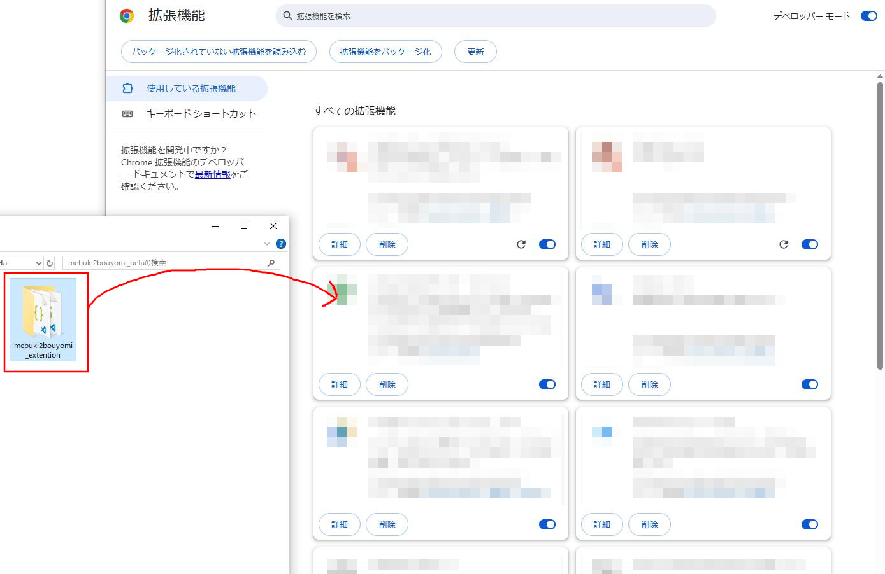
        2. 拡張機能一覧にMebuki2Bouyomiが表示されたことを確認します。 
    2. **ファイル選択画面でフォルダを選択する場合**
        1. 拡張機能メニュー内の「パッケージ化されていない拡張機能を読み込む」ボタンを押します。 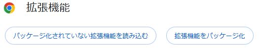
        2. 「拡張機能のディレクトリを選択してください。」ダイアログが開きます。 ZIPを解凍した中身「mebuki2bouyomi_extention」フォルダを選択状態にして「フォルダーの選択」ボタンを押します。 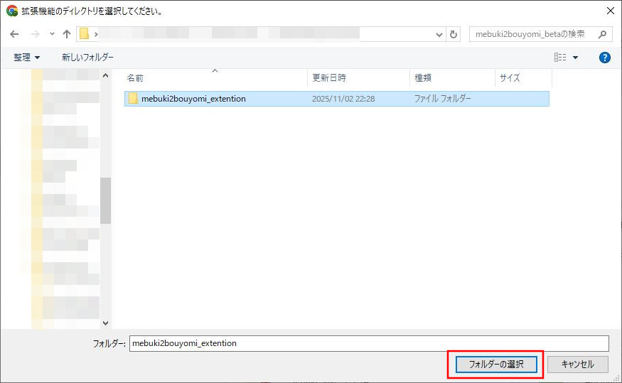
        3. 拡張機能一覧にMebuki2Bouyomiが表示されたことを確認します。 

## Microsoft Edgeへの導入
1. 拡張機能メニューを開きます。 ブラウザのアドレスバーに [edge://extensions/](edge://extensions/) と入力すると手っ取り早いです。
1. 拡張機能メニュー左側の「開発者モード」のスイッチをONにします。 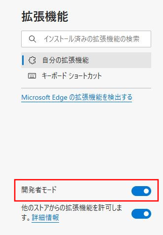
1. フォルダをドラッグ＆ドロップするか、ファイル選択画面でフォルダを指定するか２つの方法がとれます。
   1. **フォルダをドラッグ＆ドロップする場合**
      1. ZIPを解凍した中身「mebuki2bouyomi_extention」フォルダを、Chromeの拡張機能メニューへドラッグ＆ドロップします。 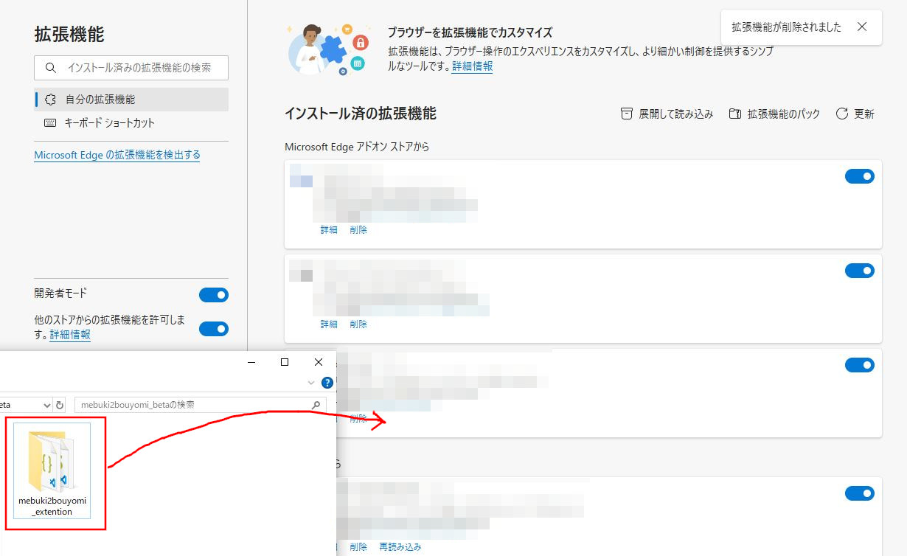
      2. 拡張機能一覧にMebuki2Bouyomiが表示されたことを確認します。 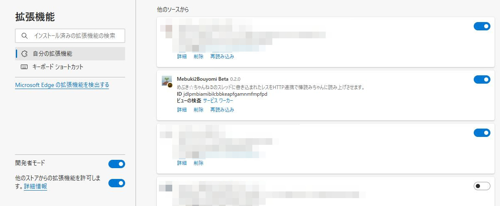
   2. **ファイル選択画面でフォルダを選択する場合**
     1. 拡張機能メニュー内の「パッケージ化されていない拡張機能を読み込む」ボタンを押します。 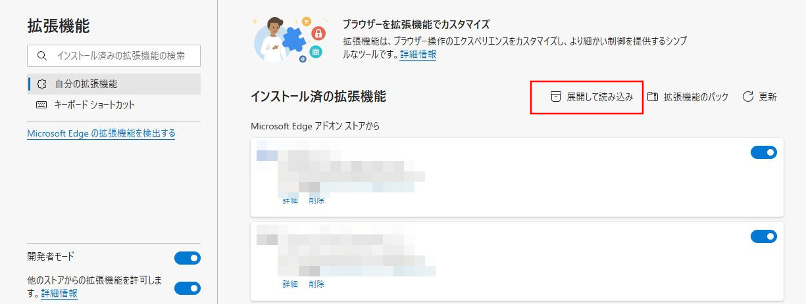
     1. 「拡張機能のディレクトリを選択してください。」ダイアログが開きます。 ZIPを解凍した中身「mebuki2bouyomi_extention」フォルダを選択状態にして「フォルダーの選択」ボタンを押します。 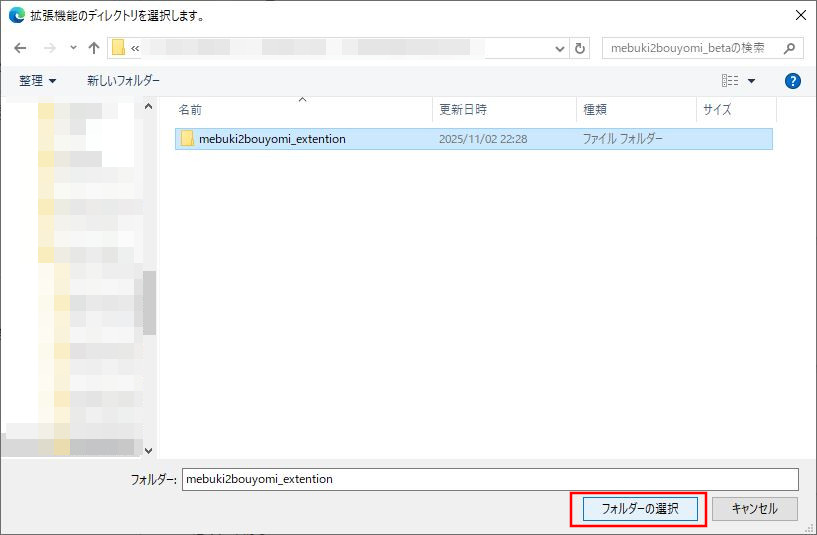
     2. 拡張機能一覧にMebuki2Bouyomiが表示されたことを確認します。 
  
 

# 事前にやっておいた方がいいこと
ブラウザ上のしばらく操作していないタブは、メモリ節約のために動作を停止することがあります。 
そのため、例えば読み上げや画像の自動保存を有効にしても、ブラウザや対象タブが非アクティブな状態が続くといつの間にか止まっていることがあります。 
安定して継続的に動作させたい場合、めぶき関連のURLは常に動作させるようブラウザで設定しておきましょう。 
 

## Google Chromeでの設定方法
設定＞パフォーマンス ([chrome://settings/performance](chrome://settings/performance)) を開きます。 
「常にアクティブにするサイト」に `mebuki.moe` が無い場合は「追加」ボタンを押します。 
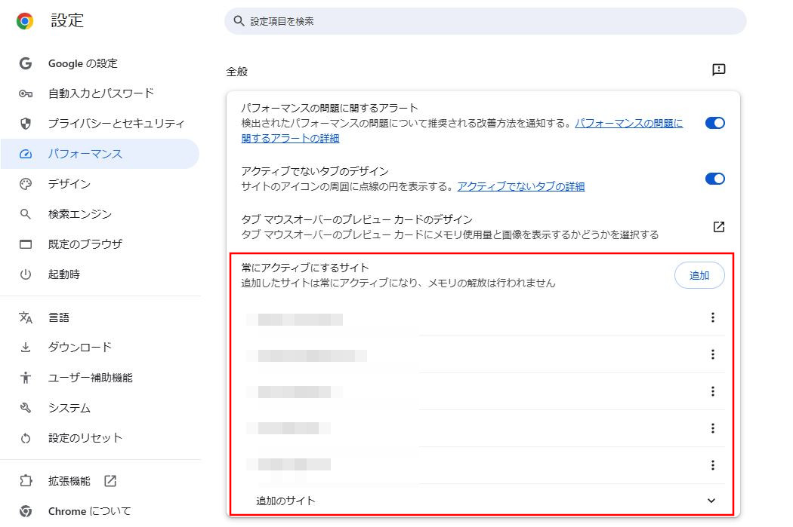 
 
いずれかのタブでめぶきのページを開いている場合、「現在のサイトを追加」の一覧に表示されます。 
一覧に `mebuki.moe` が表示されているならば、チェックして「追加」を押せば完了です。 
 
 
「現在のサイトを追加」に `mebuki.moe` が表示されていないならば「サイトを手動で追加」から設定します。 
「ウェブサイト」の入力欄に `mebuki.moe` を入力して「追加」を押しましょう。 
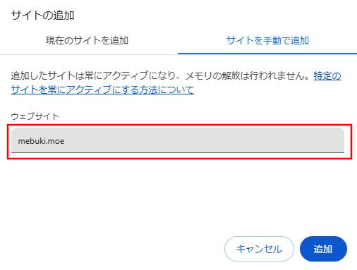 
 
「常にアクティブにするサイト」の一覧に `mebuki.moe` が表示されていればOKです。 
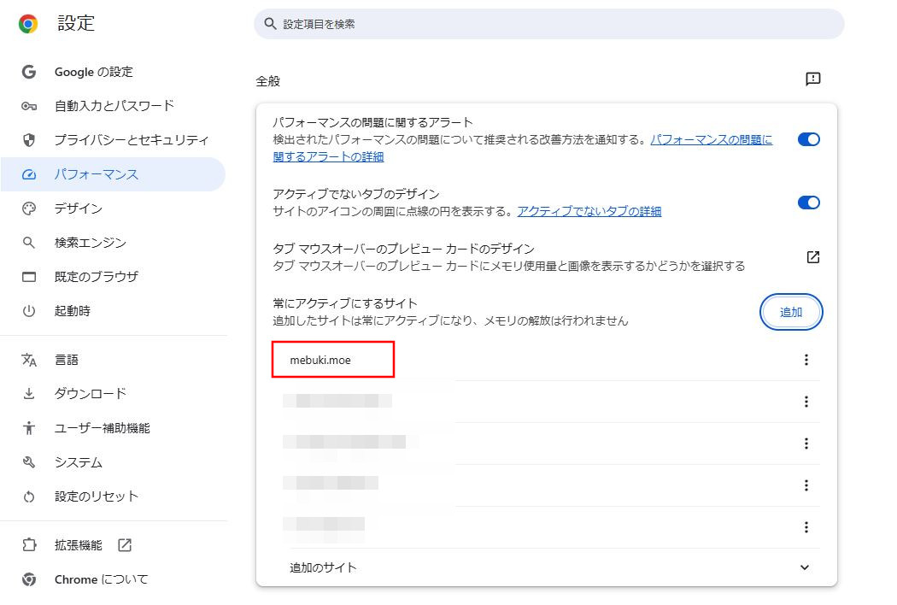

 

## Microsoft Edgeでの設定方法
設定＞システムとパフォーマンス＞パフォーマンス ([edge://settings/system/managePerformance](edge://settings/system/managePerformance)) を開きます。 
「これらのサイトをスリープ状態にしない」に `mebuki.moe` が無い場合は「サイトの追加」ボタンを押します。 
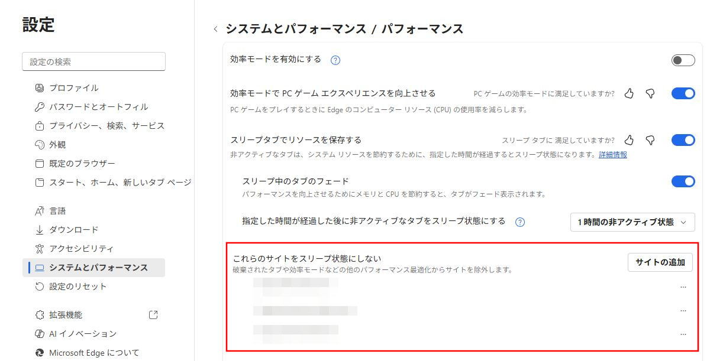 
 
「サイトの追加」ダイアログが開きます。 
`mebuki.moe` を入力して「追加」を押しましょう。 
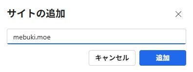 
 
「これらのサイトをスリープ状態にしない」に `mebuki.moe` が表示されていればOKです。 
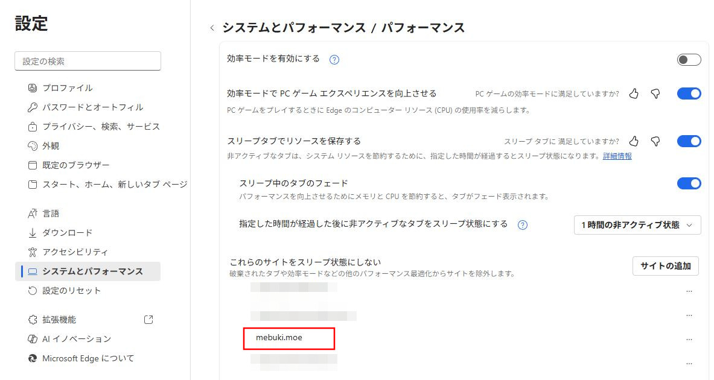

 

# 設定方法
## 棒読みちゃん 連携設定
<dl>
<dt>棒読みちゃん HTTPポート</dt>

棒読みちゃんへレス内容を転送する先のHTTPポート番号を設定します。 
入力すべきポート番号は、棒読みちゃんで**F10キー**を押して開く設定画面で以下の項目を参照してください。 
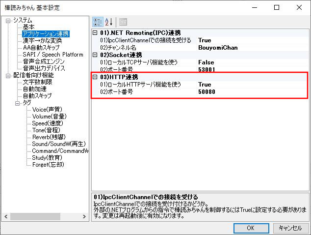 
- 01)ローカルHTTPサーバ機能を使う = **True** に設定
  - ここがTrueになっていないと外部からの連携を受け付けてくれません
- 02)ポート番号 = 50080（デフォルト値）
  - ここの数値を、拡張機能ポップアップメニューの **棒読みちゃん HTTPポート** に入力します
  - 自分で変更していないならデフォルト値である50080のままになっているはず
 

<dt>以下のテキストを検出したら自動で読み上げ開始</dt>
ここで指定した文字列がスレタイ、スレ本文に含まれているスレッドを開いた場合、自動で棒読みちゃんでの読み上げをONにします。 
 

<dt>読み上げ開始時のテキスト（空白OK）</dt>
棒読みちゃんでの読み上げを開始時に、棒読みちゃんに読み上げさせるテキストです。 
空白の場合は何も読み上げません。 
 

<dt>読み上げ停止時のテキスト（空白OK）</dt>
棒読みちゃんでの読み上げを停止時に、棒読みちゃんに読み上げさせるテキストです。 
空白の場合は何も読み上げません。 
 

<dt>スポイラーで伏せられた部分も読み上げる</dt>

レス内容にスポイラー（灰色でマスクされるやつ）で伏せられた文字が存在する場合、読み上げるかどうかを設定できます。 
OFFにするとスポイラーの箇所は全て `*****` に変換されて棒読みちゃんに送られます。 
 

<dt>改行を無視する</dt>
レス内に改行が含まれている場合の読み上げ方を設定できます。 
OFFの場合は改行ごとに文章を分割して一文ずつ読み上げます。 
ONの場合は改行のかわりに半角スペースが入り、一つの文章として読み上げます。 
 

<dt>ｷﾀｰを無視する</dt>
ｷﾀ━━━━━━(ﾟ∀ﾟ)━━━━━━ !!!!! を棒読みちゃんに送りません。 
ｷﾀｰを引用するな～！ 
 

<dt>スレ落ち時に読み上げるテキスト（空白OK）</dt>
スレッドが落ちたとき、棒読みちゃんに読み上げさせるテキストです。 
空白の場合は何も読み上げません。 
</dl>

 

## ファイル保存 連携設定
<dl>
<dt>以下のテキストを検出したら自動で読み上げ開始</dt>
ここで指定した文字列がスレタイ、スレ本文に含まれているスレッドを開いた場合、ファイルの自動保存をONにします。 
 

<dt>画像ファイル保存先</dt>

画像ファイルの保存先を指定できます。 
`${thread_id}` は対象スレッドのIDに差し替えられます。 
ただしブラウザの仕様として、ブラウザに設定したダウンロード先以下にしか保存できません。 
例えばブラウザのダウンロード先が `C:\Downloads` の状態で、デフォルト設定 `mebuki_auto_save/files/${thread_id}` だと 
`C:\Downloads\mebuki_auto_save\files\[スレッドIDフォルダ]` に保存されます。 
 

<dt>自動保存するファイルを選択する</dt>
自動保存の対象に含めるファイルの拡張子を選択します。 
後々動画なども貼れるようになったら対応しておく予定です。 
 

<dt>スポイラー対象の画像も保存する</dt>
スポイラーが設定されている画像も保存対象に含めます。 
ONにすると、保存時にスポイラーが強制的に解除されるのでご注意ください。 
 

**※※※ 以下の項目は棒読みちゃん連携orわんコメ連携がONになっている場合のみ機能します ※※※**

<dt>自動保存開始時に読み上げるテキスト（空白OK）</dt>
ファイルの自動保存が有効になった時、棒読みちゃんorわんコメに送るテキストを設定できます。 
空白の場合は何も読み上げません。 
 

<dt>自動保存停止時に読み上げるテキスト（空白OK）</dt>
ファイルの自動保存が停止した時、棒読みちゃんorわんコメに送るテキストを設定できます。 
空白の場合は何も読み上げません。 
 

<dt>ファイル保存時に読み上げるテキスト（空白OK）</dt>
新着レスのファイルを保存した時、棒読みちゃんorわんコメに送るテキストを設定できます。 
空白の場合は何も読み上げません。 

</dl>

 

## 配信支援機能 設定
### わんコメ連携前にやっておくこと
[わんコメ](https://onecomme.com/)へ転送するためには、わんコメ側で以下の設定が必要です。 
 
「設定」を開きます。 
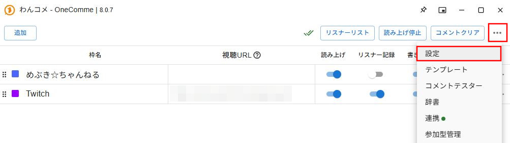 
 
「API」のタブに `mebuki.moe` を入力します。 
入力後に「保存しました」のメッセージが表示されればOKです。 
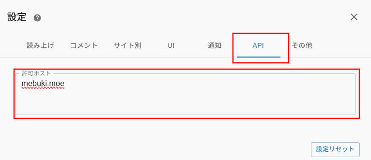 
 
事前にこの設定をやっておかないと、わんコメが拡張機能からの連携を受け取ってくれません。 
必ず最初に済ませておきましょう。 

 

### 設定項目
<dl>
<dt>スレッドIDをテキストファイルに保存する</dt>
棒読みちゃん連携orわんコメ連携を開始した最新のスレッドIDをTXTファイルに保存します。 
配信画面にスレIDを映す場合にお使いください。 
 

<dt>わんコメ連携先のID</dt>

レスを送りたいわんコメの連携先IDをここに貼り付けます。 
IDの取得方法は、わんコメの連携先に設定したい枠を右クリックして「IDをコピー」すれば取得できます。 
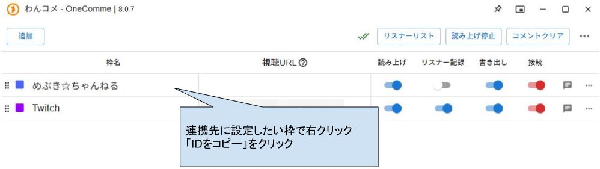
 

<dt>以下のテキストを検出したら自動で読み上げ開始</dt>
ここで指定した文字列がスレタイ、スレ本文に含まれているスレッドを開いた場合、自動でわんコメ連携をONにします。 
 

<dt>読み上げ開始時のテキスト（空白OK）</dt>
わんコメ連携開始時に、わんコメに送るテキストです。 
空白の場合は何もしません。 
 

<dt>読み上げ停止時のテキスト（空白OK）</dt>
わんコメ連携停止時に、わんコメに送るテキストです。 
空白の場合は何もしません。 
 

<dt>スポイラーで伏せられた部分も読み上げる</dt>

レス内容にスポイラー（灰色でマスクされるやつ）で伏せられた文字が存在する場合、わんコメに送るかどうかを設定できます。 
OFFにするとスポイラーの箇所は全て `*****` に変換されて送られます。 
 

<dt>改行を無視する</dt>
レス内に改行が含まれている場合の読み上げ方を設定できます。 
OFFの場合は改行を含んだままわんコメへ送ります。 
ONの場合は改行を半角スペースに置換して送ります。 
 

<dt>ｷﾀｰを無視する</dt>
ｷﾀ━━━━━━(ﾟ∀ﾟ)━━━━━━ !!!!! をわんコメに送りません。 
ｷﾀｰを引用するな～！ 
 

<dt>発言者名に表示するテキスト（空白OK）</dt>
わんコメの発言者欄に表示するテキストを設定できます。 
めぶっきーでもとしあきでも「」でも自由に設定すればええよ 
 

<dt>スレ落ち時に読み上げるテキスト（空白OK）</dt>
スレッドが落ちたとき、わんコメに送るテキストです。 
空白の場合は何もしません。 
</dl>

 

## NGワード 設定
<dl>
<dt>NGワードを含むレスは読み上げない</dt>

NGワードを含むレスは棒読みちゃんとわんコメに転送しません。 
ただしブラウザの方では表示されます。あくまで連携先に転送しないだけです。 
レスそのものを消し去るNG設定はめぶき側の設定画面にあるので、そちらをご利用くだしあ
 

<dt>NGワード管理画面を開く</dt>

別タブでNGワード管理画面を開きます。 
NGワードと一致するかの判定方法として以下の条件を指定できます。
- 部分一致
- 前方一致
- 後方一致
- 正規表現（まだバグあるかも）

</dl>

 

# 今後の開発予定
- ポップアップメニューを開かずとも、スレッドから直接各種連携のON/OFFを可能にする
- ポップアップメニューを開くたびに設定タブ「棒読みちゃん」が選択された初期状態に戻るのをなんとかする
- めぶきメニュー「お気に入り」「書き込んだスレ」から別のスレに移動した時、連携状態がリセットされない現象を改善する
- 棒読みちゃん・わんコメとの連携に失敗した場合にエラーメッセージを表示するようにする
- UIをもうちょい整理する